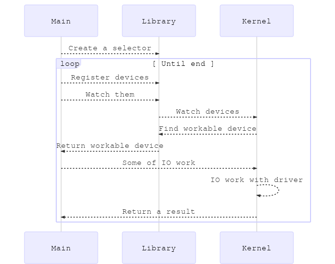
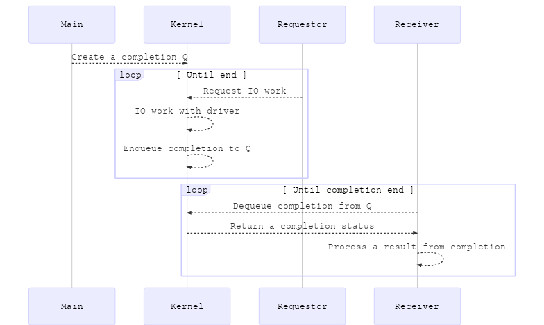
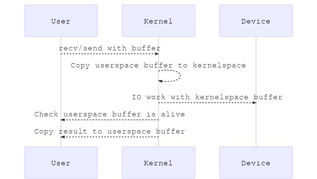
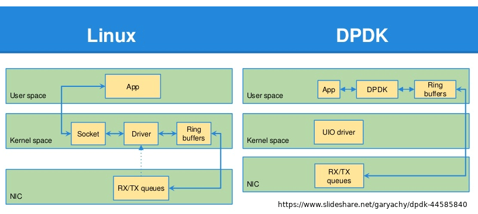
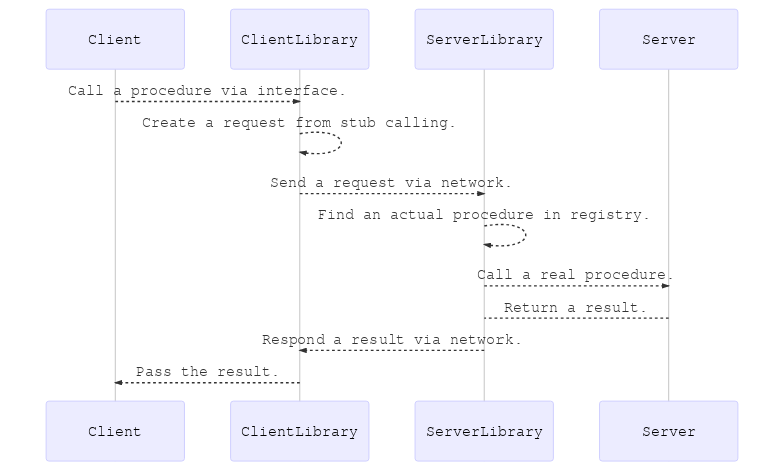

@title[Title]

~~Network programming~~  
~~TCP/IP programming~~

## Server programming Overview

---
@title[Table of contents]

### TOC

- Basic
- Memory efficiency
- IO efficiency
- Applications
- ~~Concurrency control~~

---
@title[IO]

### IO

- open
- read
- write
- close

---
@title[socket]

### Socket

- [socket in net.h](https://github.com/torvalds/linux/blob/master/include/linux/net.h)
- [sock in sock.h](https://github.com/torvalds/linux/blob/master/include/net/sock.h)
- bind, listen, accept, connect, shutdown
- sendmsg, recvmsg, sockopt

---
@title[Table of contents: Basic]

### Basic

- Synchronous IO
- Asynchronous IO
- IO Multiplexing

---
@title[Synchronous IO]

Basic form.

```
bind(port); listen(backlog);
while (sock = accept(acceptSock)) { // blocked
  while (request = recv(sock)) { // blocked
    response = process(request);
    send(sock, response);
  }
  close(sock);
}
```

---
@title[Synchronous IO: multi-threaded]

Simple: multi-threaded.

```
while (sock = accept(acceptSock)) { // blocked
  thread(() => {
    while (request = recv(sock)) { // blocked
      response = process(request);
      send(sock, response);
    }
    close(sock);
  })
}
```

---
@title[Synchronous IO: multi-threaded]

Drawbacks.

- Thread burden: allocation, scheduling costs.
- Concurrency control.
- Hard to throttle, control.

---
@title[Synchronous IO: Non-blocking]

If there is a non-blocking magic,

```
while (true) {
  sock = nb_accept(acceptSock);
  if (!sock) continue;
  while (true) { // How to process many sockets?
    request = nb_recv(sock); // Is it ok?
    if (!request) continue;
    if (request.end) break;
    response = process(request);
    nb_send(sock, response); // Is it ok?
  }
  close(sock);
}
```

---
@title[Synchronous IO: Non-blocking]

Drawbacks.

- Hard to process multiple sockets.
- Even if there is no work, but it should poll without rest.

---
@title[Asynchronous IO: callback]

How about a callback for asynchronous?

```
acceptNext = accept(acceptSock, sock => {
  processOne = () => recv(sock, request => {
    response = process(request);
    send(sock, response, processOne); // recursive
  });
  processOne();
  acceptNext(); // recursive
});
```

**Acceptd and processes one by one.**

---
@title[Asynchronous IO: await]

How about *async* and *await*?

```
while (true) {
  sock = await accept(acceptSock);
  while (request = await recv(sock))) {
    response = process(request);
    await send(sock, response);
  }
}
```

---
@title[Asynchronous IO: await]

What about the internal works?

---
@title[IO multiplexing]

Another way, IO multiplexing with **select**.

```
selector.register(acceptBegin(acceptSock));
while (true) {
  currentSock, op = selector.dequeueReadyOne();
  if (!op) { /* do other things */; continue; }
  switch (op) {
    case ACCEPT:
      selector.register(receiveBegin(acceptEnd(currentSock)));
      selector.register(acceptBegin(acceptSock));
      break;
    case RECEIVE:
      selector.register(sendBegin(process(receiveEnd(currentSock))));
      break;
    case SEND:
      selector.register(receiveBegin(currentSock));
      break;
  }
}
```

We can select a handle to be ready for IO works without blocking.

---
@title[Separation of concerns]

IO = Request + **Completion**.

```
while (completion = dequeueCompletion()) {
  if (completion.empty) { /* do other things */; continue; }
  switch (completion.type) {
    case ACCEPTED:
      receive(completion.sock, buffer);
      break;
    case RECEIVED:
      response = process(completion.buffer);
      send(completion.sock, response);
      break;
    case SENT:
      receive(completion.sock, buffer);
      break;
  }
}
```

---
@title[Ready? Completion?]

### Ready or Completion

- Because it is ready, we don't need to **block**.
- Because it is completed, we don't need to **block**.

But in the completion case,

- Kernel should do more work.

---
@title[Diagram: select]

### select



---
@title[Diagram: iocp]

### IOCP



---
@title[More]

- How to find the begin and end of a message.
- How to sort an order of messages.
- How to process an error of each cases.
- Can it use multi-core with efficient way?
- Can it use core properly when there is no IO work?

---
@title[Table of contents: Memory efficiency]

### Memory efficiency

- Memory copy
- Registered IO

---
@title[Memory copy]

### Memory copy



---

#### Alive?

A memory in userspace 

- can be pagable. *paged pool*
- can be deallocated before IO completion.
- can be insufficient.


```
char* buffer = new char[4096]; // If data is bigger than this?
read_async(socket, buffer, 4096); // If buffer is paged?
delete buffer; // What the?
```

---

#### Page locking

- Make a memory not to be paging.

#### Non paged pool

- Memory space which doesn't be paged.

---

#### Zero-byte-receive

##### Steps

1. Request 0-bytes receive.
2. Receive a length from completion.
3. Allocate a buffer of that size and receive data.


##### Benefits

- Because of 0-bytes in *step 1*, it doesn't lock a memory.
- Because data is ready in *step 3*, it doesn't lock a memory.

---
@title[Registered]

### Registered IO

- A lock is a sufficiently expensive resource.
- Resources in kernel should have a their lock.
- Can we avoid this?

*The answer is registering these resources at startup.*

---

Registered IO on Microsoft.

- Register a request and completion queue.
- Register buffers.

And almost same with IOCP, but,

- Must manage manually concurrency of them.

See also,

- [Windows Registered I/O (RIO) Introduction & Performance - sm9kr](https://www.slideshare.net/sm9kr/windows-registered-io-rio)
- [Windows IOCP vs Linux EPOLL Performance Comparison - sm9kr](https://www.slideshare.net/sm9kr/iocp-vs-epoll-perfor)

---
@title[Table of contents: IO efficiency]

### IO efficiency

- Nagel algorithm
- QUIC
- DPDK

---
@title[Nagle's algorithm]

### Nagle's algorithm

> Nagle's algorithm is a means of improving the efficiency of TCP/IP networks by reducing the number of packets that need to be sent over the network.

- Then, is it the best solution for all situations?

---
@title[QUIC]

### Quick UDP Internet Connections

> QUIC is a new transport which reduces latency compared to that of TCP. On the surface, QUIC is very similar to TCP+TLS+HTTP/2 implemented on UDP.

- https://www.chromium.org/quic

---


---
@title[dpdk]

### Data plane development kit

> The Data Plane Development Kit (DPDK) is a set of data plane libraries and network interface controller drivers for fast packet processing, currently managed as an open-source project under the Linux Foundation. The DPDK includes data plane libraries and optimized network interface controller (NIC) drivers.

- [DPDK wiki](https://en.wikipedia.org/wiki/Data_Plane_Development_Kit)
- [dpdk.org](https://www.dpdk.org/)
- [Understanding DPDK](https://www.slideshare.net/garyachy/dpdk-44585840)

---

- A queue manager implements lockless queues.
- A buffer manager pre-allocates fixed size buffers.
- A memory manager allocates pools of objects in memory and uses a ring to store free objects; ensures that objects are spread equally on all DRAM channels.
- Poll mode drivers (PMD) are designed to work without asynchronous notifications, reducing overhead.
- A packet framework – a set of libraries that are helpers to develop packet processing.

---



---
@title[Table of contents: Applications]

### Applications

- Remote procedure call w/ message format, serializer

---
@title[RPC]

### Remote procedure call

> Remote procedure call (RPC) is when a computer program causes a procedure (subroutine) to execute in a different address space (commonly on another computer on a shared network), which is coded as if it were a normal (local) procedure call, without the programmer explicitly coding the details for the remote interaction.

- [RPC wiki](https://en.wikipedia.org/wiki/Remote_procedure_call)

---

In client,

```
const result = server.add(1, 2);
```

In server,

```
module.exports.add = (a, b) => a + b;
```

How could do this?

---



---
@title[Serialization]

### Serialization

> Serialization is the process of translating data structures or object state into a format that can be stored (for example, in a file or memory buffer) or transmitted (for example, across a network connection link) and reconstructed later (possibly in a different computer environment).

- [Serialization wiki](https://en.wikipedia.org/wiki/Serialization)

---
@title[Serialization: Examples]

### Serialization with

- [Base64](https://en.wikipedia.org/wiki/Base64)
- [XML](https://en.wikipedia.org/wiki/XML)
- [JSON](http://json.org/)
- [Protobuf](https://developers.google.com/protocol-buffers/)
- [FlatBuffer](https://google.github.io/flatbuffers/)
- [Cap'n Proto](https://capnproto.org/)
- [pickle](https://docs.python.org/3/library/pickle.html)

---
@title[More and more]

### Think more

- What is your domain?
- How about your expected Packet/Secs or Bandwidth/Secs?
- Is it has CPU-bound or IO-bound? Or does it have another IO job such as serving static files?
- What about your messaging format?
- Isn't there another protocol or integration method?
